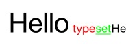

# Typeset [](http://cocoadocs.org/docsets/Typeset) [](https://travis-ci.org/Draveness/Typeset)  

----

An convenient and fast approach to create `AttributedString`.

This library is inspired by [colorize](https://github.com/fazibear/colorize) which is a ruby gem colorize string.

Typeset give you a far more convenient and powerful way to manipulate attributed string.

# The Old Way

With the old way, create am attributed string is very complex and verbose.

```
NSMutableAttributedString *mas = [[NSMutableAttributedString alloc] initWithString:@"Hello typeset"];
NSRange range = [mas.string rangeOfString:@"Hello"];
[mas addAttribute:NSFontAttributeName value:[UIFont systemFontOfSize:40] range:range];
range = [mas.string rangeOfString:@"type"];
[mas addAttribute:NSForegroundColorAttributeName value:[UIColor redColor] range:range];
range = [mas.string rangeOfString:@"set"];
[mas addAttribute:NSForegroundColorAttributeName value:[UIColor blueColor] range:range];
label.attributedText = mas;
```

# With Typeset

```
NSMutableAttributedString *mas = @"Hello typeset".typeset
   .match(@"Hello").fontSize(40)
   .match(@"type").purple
   .match(@"set").blue
   .string;
label.attributedText = mas;
```


This is very powerful and easy to read and write.

----

# How To Get Started

## Installation with CocoaPods

[CocoaPods](https://cocoapods.org/) is a dependency manager for Objective-C, which automates and simplifies the process of using 3rd-party libraries like DKNightVersion in your projects. See the [Get Started section](https://cocoapods.org/#get_started) for more details.

## Podfile

```
pod "Typeset", "~> 3.1.0"
```

## Usage

Add one line of code to your precompiled header, or import it where you need.

```objectivec
#import "Typeset.h"
```

## How to use

Using Typeset to deal with string is very easily. You should send `typeset` method to string first, customize it and send message `string` as last to get the final attributed string.

```objectivec
NSMutableAttributedString *mas = @"Hello typeset".typeset
   .match(@"Hello").fontSize(40)
   .match(@"type").red
   .match(@"set").green
   .underline(NSUnderlineStyleSingle)
   .append(@"He").string;
```



## UILabel Support

We add `typesetBlock` to UILabel, and you can directly set it's text style with:

```objectivec
label.typesetBlock = TS.matchAll(@"Hello").fontSize(40)
                       .match(@"type").purple
                       .match(@"set").blue.ST;
label.text = @"Hello typeset, hello.";
```


## Swift 

**If you would like to use chainable syntax to create attributed string with swift, use [Crotalus](https://github.com/Draveness/Crotalus) instread**


## Colorize

If you want to colorize a literal string to red.
 
```objectivec
@"Hello".typeset.red.string;
```

This will return a `NSMutableAttributedString with red color.

Typeset also provide a neat way to do this.

```objectivec
// The same as '@"Hello".typeset.red.string;'
@"Hello".red;
@"Hello".green;
@"Hello".color([UIColor whiteColor]);
@"Hello".hexColor(0x313131);
```

Typeset providing all the built-in colors in UIKit. So you can use them easily.

```objectivec
- (TypesetKit *)black;
- (TypesetKit *)darkGray;
- (TypesetKit *)lightGray;
- (TypesetKit *)white;
- (TypesetKit *)gray;
- (TypesetKit *)red;
- (TypesetKit *)green;
- (TypesetKit *)blue;
- (TypesetKit *)cyan;
- (TypesetKit *)yellow;
- (TypesetKit *)magenta;
- (TypesetKit *)orange;
- (TypesetKit *)purple;
- (TypesetKit *)brown;
- (TypesetKit *)clear;

- (TypesettingColorBlock)color;
- (TypesettingIntegerBlock)hexColor; // @"string".typeset.hexColor(0xffffff).string
```


## Font

```objectivec
- (TypesettingStringBlock)fontName;
- (TypesettingCGFloatBlock)fontSize;
- (TypesettingFontBlock)font;

- (TypesetKit *)regular;
- (TypesetKit *)light;
- (TypesetKit *)bold;
- (TypesetKit *)italic;
- (TypesetKit *)thin;
```

Use `fontSize(size)` `fontName(name)` to change a string's font size or name.

```objectivec
@"Hello".typeset.fontSize(40.0).string;
@"Hello".typeset.fontName(@"Helvetica").string;
```

If you want to change both font size or name, use `font(name, size)`.

```objectivec
@"Hello".typeset.font(@"Helvetica, 40.0).string;
@"Hello".font(@"Helvetica, 40.0);
```

## Match Part of String

Typeset change total string by default. But you can use these method to change part of string.

* `from(i)` `to(i)` 
* `location(i)` `length(i)` 
* `range(range)`
* `match(string)` 
* `matchAll(string)`

If you want to change `He` of `Hello` to red.

```objectivec
@"Hello".typeset.from(0).to(2).red.string;
@"Hello".typeset.location(0).length(2).red.string;
@"Hello".typeset.range(NSMakeRange(0,2)).red.string;
@"Hello".typeset.match(@"He").red.string;
```

> `match` method match the first pattern appear in the 
> string, if you want to customize mutiple pattern, you should
> not use this method.

## Append

Typeset provide a more elegant method `append` to concat mutiple `NSMutableAttributedString`.

```objectivec
mas.append(mas).append(mas);
```

## Style

```objectivec
- (TypesettingStrikeThroughBlock)strikeThrough;

- (TypesettingBaselineBlock)baseline;

- (TypesettingIntegerBlock)underline;

- (TypesettingStringBlock)link;

- (TypesettingStringBlock)append;

- (TypesettingIntegerBlock)ligature;

- (TypesettingCGFloatBlock)kern;

- (TypesettingIntegerBlock)lineBreakMode;

- (TypesettingIntegerBlock)textAlignment;

- (TypesettingCGFloatBlock)lineSpacing;
```

### Underline

Use `underline(style)` adding underline to string.

```objectivec
@"Hello".typeset.underline(NSUnderlineStyleSingle).string;
```

# Contribute

Feel free to open an issue or pull request, if you need help or there is a bug.

# Contact

- Powered by [Draveness](http://github.com/draveness)
- Personal website [DeltaX](http://deltax.me)

# License

Typeset is available under the MIT license. See the LICENSE file for more info.

# Todo

- Documentation
- More features


