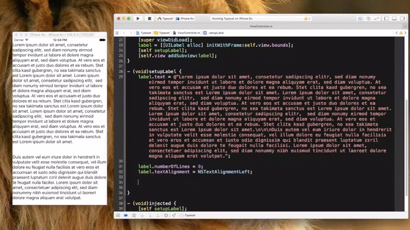

<p align="center">

</p>

<p align="center">
[](http://cocoadocs.org/docsets/Typeset) [](https://travis-ci.org/Draveness/Typeset)  

----

Typeset makes it easy to create `NSAttributedString`

```
@"Hello typeset".typeset
   .match(@"Hello").fontSize(40)
   .match(@"type").purple
   .match(@"set").blue
   .string;
```

# Demo

<p align="center">

<p align="center">


# Usage

+ Method chaining
	+ All the method for typeset returns a `self` object to chaining itself.

		```
		@"Hello typeset".typeset
		   .match(@"Hello").fontSize(40)
		   .match(@"type").purple
		   .match(@"set").blue
		   .string;
		```
		
	> call `typeset` method first and call `string` at last returns a `NSAttributedString`.
		
+ UILabel support
	+ Add `typesetBlock` to UILabel, and you can directly set it's text style with:

	```objectivec
	label.typesetBlock = TSBlock(fontSize(40)
	                       .match(@"type").purple
	                       .match(@"set").blue);
	label.text = @"Hello typeset, hello.";
	```
	
+ Match part of string
	+ Typeset providing a series of method to match part of your string, you can use these method to select part of your string, and add attribute to it.

	```objectivec
	@"Hello".typeset.from(0).to(2).red.string;
	@"Hello".typeset.location(0).length(2).red.string;
	@"Hello".typeset.range(NSMakeRange(0,2)).red.string;
	@"Hello".typeset.match(@"He").red.string;
	```
	
	> These lines of code all make `@"He"` of `@"Hello"` to red
	
	| Match Method                                           | Explain                                                |
	| ------------------------------------------------------ | ------------------------------------------------------ |
	| `from(NSUInteger)` `to(NSUInteger)`                    |                                                        |
	| `location(NSUInteger)` `length(NSUInteger)`            |                                                        |
	| `range(NSRange)`                                       |                                                        |
    | `match(NSString *)`                                    | match the first substring                              |
    | `matchWithOptions(NSString *, NSStringCompareOptions)` | match the first substring with options                 |
	| `matchAll(NSString)`                                   | match all the substring                                |
    | `matchAllWithOptions(NSString *, NSStringCompareOptions)`| match all the substring with options                 |
    | `all`                                                  | select all the string                                  |

+ Convinient method
	+ If you don't want to change some part of the string, and only want to **change the color or the font**, you call call these methods directly without calling `typeset` first

	```objectivec
	@"Hello".red
	@"Hello".fontSize(20).red
	```


## References

### Attributes

| Dictionary Key                      | `Typeset` Method                                       |
| ----------------------------------- | ------------------------------------------------------ |
| `NSFontAttributeName`               | `font(NSString fontName, CGFloat size)`                |
|                                     | `fontSize(CGFloat size)`                               |
|                                     | `fontName(NSString name)`                              |
|                                     | `regular` `light` `italic` `thin` `bold`               |
| `NSForegroundColorAttributeName`    | `color(UIColor color)`                                 |
|                                     | `hexColor(CGFloat hexColor)`                           |
|                                     | `black` `darkGray` `lightGray` `white` `gray` `red` `green` `blue` `cyan` `yellow` `magenta` `orange` `purple` `brown` `clear`                                |
| `NSKernAttributeName`               | `kern(CGFloat kern)`                                   |
| `NSUnderlineStyleAttributeName`     | `underline(NSUnderlineStyle underline)`                |
| `NSUnderlineColorAttributeName`     | `underlineColor(UIColor *underlineColor)`              |
| `NSBaselineOffsetAttributeName`     | `baseline(CGFloat baseline)`                           |
| `NSStrikethroughStyleAttributeName` | `strikeThrough(NSUnderlineStyle strikeThrough)`        |
| `NSStrikethroughColorAttributeName` | `strikeThroughColor(UIColor *underlineColor)`          |
| `NSLinkAttributeName`               | `link(NSString *url)`                                  |
| `NSLigatureAttributeName`           | `ligature(NSUInteger ligature)`                        |
| `NSStrokeColorAttributeName`        | `strokeColor(UIColor *strokeColor)`                    |
| `NSStrokeWidthAttributeName`        | `strokeWidth(CGFloat strokeWidth)`                     |
| `NSShadowAttributeName`             | `shadow(NSShadow *shadow)`                             |
| `NSTextEffectAttributeName`         | `textEffect(NSString *textEffect)`                     |
| `NSObliquenessAttributeName`        | `obliqueness(CGFloat obliqueness)`                     |
| `NSExpansionAttributeName`          | `expansion(CGFloat expansion)`                         |
| `NSParagraphStyleAttributeName`     | `lineBreakMode(NSLineBreakMode lineBreakMode)`         |
|                                     | `textAlignment(NSTextAlignment textAlignment)`         |
|                                     | `lineSpacing(CGFloat lineSpacing)`                     |

## Installation 

### CocoaPods

[CocoaPods](https://cocoapods.org/) is a dependency manager for Objective-C, which automates and simplifies the process of using 3rd-party libraries like Typeset in your projects. See the [Get Started section](https://cocoapods.org/#get_started) for more details.

## Podfile

```
pod "Typeset"
```

# Contribute

Feel free to open an issue or pull request, if you need help or there is a bug.

# Contact

- Powered by [Draveness](http://github.com/draveness)

# License

Typeset is available under the MIT license. See the LICENSE file for more info.

# Todo

- Documentation
- More features

